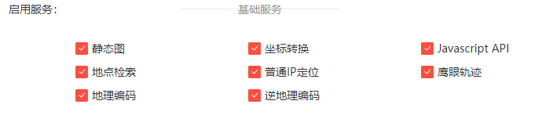

# 摩旅地图
介于本人***二轮车驾驶员***在节假日不知道去哪儿玩所做的一个小项目，用来记录周边的有趣的景点，并收录成地图(基于百度地图)的形式。

## 演示地址
[https://moto-map-9cfv.vercel.app/](https://moto-map-9cfv.vercel.app/)(部署到 Vercel)  
[https://moto.ayou10031.cn/](https://moto.ayou10031.cn/)(部署到 Vercel,使用自定义域名)

## 部署到 Vercel
首先你需要 **Fork** 本项目到您的仓库，然后在 **Vercel** 平台上面导入自己的项目！之后 **Vercel** 会自动部署，当你修改文件也会自动更新。  
[](https://vercel.com/new/clone?repository-url=https%3A%2F%2Fgithub.com%2FAyouuuu%2FMotoMap)

## 用法
[百度坐标拾取系统](https://api.map.baidu.com/lbsapi/getpoint/index.html)
### 项目配置
`src/data/config.json`
```json
{
  "title": "MotoMap",   # 标题,
  "ak": "",             # 百度地图 API 密钥
  "center": {
    "lng": 116.391889,  # 经度
    "lat": 39.893197,   # 维度
    "zoom": 11          # 缩放尺寸
  },
  "icons": {            # 图标地址
    "red": "https://pic.imgdb.cn/item/6322b19416f2c2beb1b2f4fc.png",
    "orange": "https://pic.imgdb.cn/item/6322b19416f2c2beb1b2f4f7.png",
    "blue": "https://pic.imgdb.cn/item/6322b19416f2c2beb1b2f4f2.png",
    "origin": "https://www.iconfont.cn/search/index?searchType=icon&q=%E5%AE%9A%E4%BD%8D&page=1&fromCollection=1&fills=&tag="
  }
}
```
注意：百度地图 API 密钥可不填，以下功能可能无法使用

### 添加坐标
`src/data/loc.json`
```json
  {
    "position": {
      "lng": 116.314592,    # 经度
      "lat": 39.926635      # 纬度
    },
    "content": "中塔公园",    # 标题
    "animation": "",
    "link": "链接地址",       
    "linkContent": "简介。。。",
    "icon": "blue"           # 可选 orange(已准备去)、blue(未来计划)、red(默认已经去过)
  }
```
